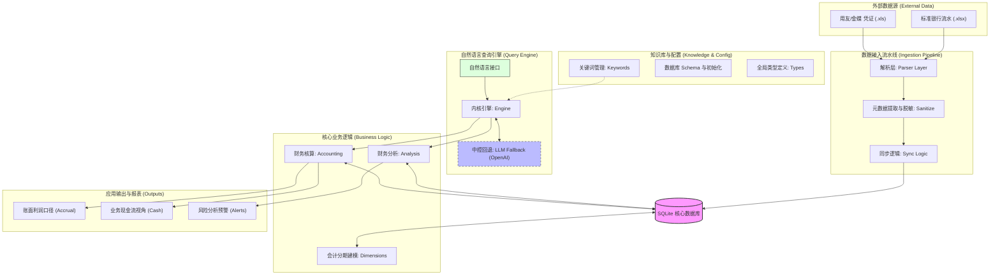

# Finance QA - Go 版本核心架构

`finance_qa` 是一个旨在替代传统手工处理，打通底层序时账（Journal）与宏观财务报表映射链条的智能化查询引擎系统。
本项目从原先的 Node.js/TypeScript 重构为了 **Go** 版本，显著提升了并发解析稳定性及数据处理速度。

## 一、核心特色能力

### 1. 绝对可靠的数据血缘
摒弃了解析不可控报表的低效路线，系统将最细粒度的**“序时帐”**作为唯一的、确定的数据源，自底向上构建业务：
- **全格式兼容**：内建 `Python/xlrd` 回落机制，支持老式用友/金蝶产生的 OLE2 腐败文件，并实现了**全自动多页签 (Multi-sheet) 遍历解析**。
- **智能期间识别**：支持复合期间报表（如 `2026.01-2026.02`）的无损提取与分录重组。
- **财务演算引擎**：`calculator.go` 自动利用财务准则聚沙成塔，无需人工结果表即可复现科目余额表与利润逻辑。

### 2. 生态首创的双口径核算
为了调和业务老板（看现金）与审计财务（看税表）的视角差距，系统开创了双视角输出：
* **业务现金流口径(看钱)**：不看纸面报表，直穿 1001/1002 银行科目，排除全部虚拟预提等粉饰动作，告诉你真金白银花哪里了。
* **财务做账口径(看利润)**：严守权责发生制，精准复现次月摊销与年底税前红字冲账影响账面记录的原因。

## 核心能力

- **三位一体身份核验 (Trinity Identity Detector)**：系统不再盲目识别动词，而是通过**银行现金流向（In/Out）**、**会计科目归属（AR/AP）**及**税务特征（进项/销项）**三位一体交叉核验，自动锁定实体身为“客户”、“供应商”或“项目”。
- **数据库辅助识别 (DB-Assisted Recognition)**：集成动态回溯算法，解决口语化提问（如“飞未云科多少钱”）中由于缺少后缀、动词导致的解析难题。
- **审计穿透挖掘 (Summary Penetration)**：自动扫描序时账摘要字段，提取银行流水中缺失的往来单位信息。
- **自动日期锚定 (Dynamic Anchoring)**：智能识别数据库最新业务月份，确保模糊时间查询（如“今年”、“本月”）准确命中。
- **资产负债审计**：实时计算任意日期的科目余额与资产负债表勾稽关系。
- **零配置执行**：支持**项目根目录自动探测**（基于 `go.mod` 自动寻址），确保系统始终准确命中真相源。

## 二、运行与测试指南

### 1. 环境依赖
* **开发环境**：`Go >= 1.20`
* **底层库依赖**：请确保系统已安装 `Python3` 及 `xlrd` 库（用于保障老系统账本解析稳定）。
* **数据库**：使用原生的 `SQLite3` (默认路径 `finance.db` 和测试表 `test_data/`)。

### 2. 构建与运行
```bash
# 1. 编译系统
go build ./cmd/financeqa/...

# 2. 从本地文件夹全量导入初始化数据库
./financeqa sync "/path/to/exported/excel/files"

# 3. 命令行自然语言查询大体验
./financeqa query --company "你的公司名称" "这个月花了多少钱"
./financeqa query "今年客户收入总和汇总"
```

### 3. 运行测试套件
新重构版本的测试已深度囊括各项业务边界：
```bash
# 执行审计回归报告，一键核验 15 道核心生产审计刁测题 (南京优集实测集)
/opt/homebrew/bin/go run tests/scripts/prod_audit_regression.go

# 执行后端核心模块单测
go test ./internal/accounting/ -v
```

## 三、代码集成与调用指南 (API / SDK)

除了使用 CLI 之外，本模块被设计为极具解耦性的 Go SDK。你可以非常简单地将其接入到任何现有的 HTTP 服务（如 Gin/Fiber/HTTPMUX）或者更大的 LLM RAG Agent 层中：

```go
package main

import (
	"fmt"
	"encoding/json"
	"financeqa/internal/query"
)

func main() {
	// 1. 实例化查询引擎 (需传入 sqlite 数据库路径与默认公司名)
	// 如果公司名传空，引擎会尝试自动从自然语言中提取
	engine, err := query.NewEngine("finance.db", "模拟财务")
	if err != nil {
		panic(err)
	}

	// 2. 将自然语言问题直接喂入 query 分析树
	// 解析器会自动执行：NLP实体提取 -> 时间轴降维 -> 业务归一化 -> SQLite计算映射
	res := engine.Query("今年合作伙伴A客户销售额是多少")

	// 3. 处理结果 (res 包含 Success / Message / Data / SQL)
	if res.Success {
		// Data 为灵活的 map[string]any，包含了历史履历(history)和多口径对比
		output, _ := json.MarshalIndent(res.Data, "", "  ")
		fmt.Printf("查询成功: %s\n%s\n", res.Message, string(output))
	} else {
		// 捕捉 Fallback 未接住的意图断层
		fmt.Printf("查询失败: %s\n", res.Message)
	}
}
```

> **系统接入优势**：`engine.Query()` 是线程（Goroutine）安全的，因为底层使用的 `sql.DB` 自带连接池机制，你可以安全地在 Web 服务器的 handler 里面并发调用它。

## 四、 系统架构与模块设计

本项目采用分层解耦的 Go 后端架构，确保了从原始凭证解析到自然语言查询的全链路稳定性。

### 1. 架构图 (Architectural Overview)



### 2. 逻辑分层
*   **接入层 (Parser & Ingest)**：处理各版本用友、金蝶及银行导出的 Excel 原始数据。具备自动脱敏、元数据提取（日期/公司识别）及数据清洗能力。
*   **持久层 (DB & Dimensions)**：基于 SQLite。采用多维模型（Dimensions）管理财务周期，支持快速切换公司与会计月份。
*   **计算层 (Accounting)**：核心业务大脑。实现了从“序时账”自动平衡“科目余额表”及“利润表”的算法，支持“钱（现金流）”与“账（权责发生制）”的双口径核算。
*   **查询层 (Query)**：混合式自然语言引擎。集成业务规则库、正则表达式匹配，并在意图不明时自动回退（Fallback）至 LLM（如 GPT-4o-mini）进行语义理解。

### 2. 目录结构
```text
finance_qa/
├── cmd/
│   └── financeqa/          # CLI 工具主入口 (main.go)
├── internal/               # 核心业务逻辑 (不向外部包公开)
│   ├── accounting/         # 财务结算引擎核心 (科目平衡、利润计算、双口径对比)
│   ├── analysis/           # 财务指标分析 (账龄分析、健康度评估)
│   ├── config/             # 配置管理与关键字管理
│   ├── db/                 # 数据库 Schema 管理与初始化
│   ├── dimensions/         # 财务维度建模与仓储模式
│   ├── ingest/             # 数据流水线与同步处理器
│   ├── parser/             # Excel 解析器与元数据自动提取
│   ├── query/              # 自然语言查询引擎 (含词法归一化与 LLM Fallback)
│   ├── support/            # 全局路径与工具支持
│   └── types/              # 通用数据结构定义
├── tests/                  # 质量保障体系 (完全独立于源代码)
│   ├── unit/               # 单元测试 (按模块镜像排列，执行黑盒验证)
│   ├── integration/        # 集成测试 (覆盖 15 道核心财务刁测)
│   ├── testdata/           # 样本库 (已脱敏的典型财务报表样本)
│   └── scripts/            # 开发工具脚本 (test_runner.go)
├── docs/                   # 项目说明文档
└── README.md
```

## 五、 环境与测试

### 1. 环境依赖
*   **Go**: `>= 1.20`
*   **Python3**: 部分老旧 XLS 解析需依赖 `xlrd` 插件作为容错回退。
*   **环境变量**: 若需启用 LLM 回退功能，请配置 `OPENAI_API_KEY`。

### 2. 运行测试
本项目采用全自动化的集成测试套件，可一键验证重构后的业务逻辑对齐情况：
```bash
# 运行单元测试
go test ./internal/...

# 运行集成测试 (全量覆盖业务场景)
go test ./tests/integration/...

# 运行回归检查工具 (自动输出 15 道生产提问的审计对照表)
/opt/homebrew/bin/go run tests/scripts/prod_audit_regression.go
```
