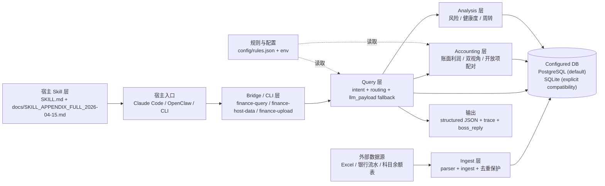

# 分层架构图（Layered Architecture）

## 说明

1. 宿主默认先读取根目录 `SKILL.md`，需要细粒度规则时再按相对路径读取 `docs/SKILL_APPENDIX_FULL_2026-04-15.md`。
2. `Query` 是业务入口，负责意图识别、实体识别、路由、失败兜底与结构化返回。
3. `Accounting` 负责账面利润、双视角勾稽、应收应付开放项配对、人力成本与税额计算。
4. 底层数据库是“配置化 DB”：默认走 PostgreSQL，仅在显式传入 SQLite 路径时启用兼容模式；不再默认回退根目录 `finance.db`。
