# 分层架构图（Layered Architecture）

```mermaid
flowchart LR
    A["外部数据源<br/>财报 Excel / 银行流水 / 序时账 / 科目余额 / 合同收入成本台账"] --> B["Ingest 层<br/>parser + ingest + 合并单元格展开 + 来源分区覆盖"]
    B --> C[("Configured DB<br/>PostgreSQL default<br/>SQLite explicit compatibility")]
    C -. 表/字段注释 .-> SRC["Source Catalog<br/>schema_comment_reader + source_attribution_*<br/>financeqa_source 元数据"]

    S["宿主 Skill 层<br/>SKILL.md + docs/SKILL_APPENDIX_FULL.md"] --> H["宿主入口<br/>OpenClaw / Claude Code / CLI"]
    H --> BR["Bridge / CLI 层<br/>finance-query / finance-host-data / finance-upload<br/>finance-sync / finance-dimensions"]
    BR --> RT["Query Runtime<br/>engine_runtime + result_types"]

    RT --> RW["老板问题改写<br/>query_rewrite<br/>期间 / 指标 / 实体 / 口径槽位"]
    RW --> CAT["语义能力目录<br/>semantic_catalog<br/>表注释 + 字段注释 + 功能模块"]
    CAT --> PROBE["轻量覆盖探测<br/>source_probe + source_probe_contracts"]
    PROBE --> RD["主口径决策<br/>route_decision<br/>contract_aggregate / bank_statement / fallback"]

    RD --> EXEC["执行编排层<br/>query_execution + query_execution_stage_policy<br/>query_family_router + query_planner + query_spec"]
    EXEC --> CASH["显式现金直查<br/>bank_cash_queries"]
    EXEC --> QO["多源编排<br/>orchestrator + source_registry + orchestrated_*"]
    EXEC --> QFB["专项 / 兜底查询<br/>fallback / precise / hr / tax / readiness / counterparty"]

    QO --> SA["Source Adapter 层<br/>core_metrics / arap / contracts / supplier / readiness"]
    QO --> CA["合同/专家表汇总<br/>contract_aggregate_*<br/>fin_contracts + fin_fund_income + fin_cost_settlements"]

    SA --> ACC["Accounting 层<br/>账面利润 / 现金差异桥 / 开放项配对"]
    QFB --> ACC
    CASH --> C
    CA --> C
    SA --> C
    QFB --> C
    ACC --> C

    CFG["规则与配置<br/>config/rules.json + env"] -.读取.-> RW
    CFG -.读取.-> EXEC
    CFG -.读取.-> QFB

    EXEC --> FIN["收口与归因<br/>query_finalize + source_attribution_*<br/>source_note / source_documents"]
    SRC --> FIN
    FIN --> O["输出<br/>structured JSON + boss_reply + route_decision + trace"]
    O --> SAN["老板可见层<br/>隐藏 id / 科目代码 / SQL / trace<br/>只展示金额 / 期间 / 口径 / 来源 Excel"]
```

## 说明

1. 老板核心指标默认先尝试合同/专家表口径：`fin_contracts + fin_fund_income + fin_cost_settlements`。
2. 合同/专家表是否能回答，不靠关键词硬猜，而是经过 `query_rewrite -> semantic_catalog -> source_probe -> route_decision`。
3. 明确现金问题（银行、银行卡、实际到账、实际支出、回款、付款、净增加）优先走 `bank_cash_queries`。
4. `query_execution*` 负责执行阶段排序和回退策略；合同优先问题只有在合同表不能覆盖时，才显式回退到现金或财务账口径。
5. `orchestrator + source_adapter_*` 负责多源事实集合并，`contract_aggregate_*` 负责老板口径的合同/项目汇总。
6. 来源追溯统一在查询收口阶段完成：优先读取表/字段注释中的结构化 `financeqa_source` 元数据，生成 `source_note/source_documents`。
7. 底层数据库默认 PostgreSQL；SQLite 只作为显式本地兼容模式，不再默认回退根目录 `finance.db`。
8. Bridge 当前暴露 5 个工具：`finance-query`、`finance-host-data`、`finance-upload`、`finance-sync`、`finance-dimensions`。
9. 接口 JSON 必须保留 `route_decision/probe_results/trace/executed_sql` 等审计字段；老板可见回复必须翻译成业务概念，不直接展示数据库辅助字段。
