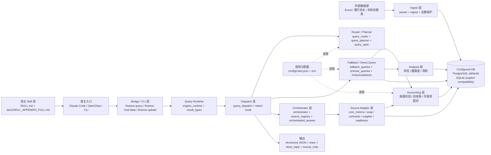

# 分层架构图（Layered Architecture）

## 说明

1. 宿主默认先读取根目录 `SKILL.md`，需要细粒度规则时再按相对路径读取 `docs/SKILL_APPENDIX_FULL.md`。
2. 查询入口已经拆成薄运行时：`engine_runtime.go` 只负责 DB/bootstrap、company 解析与 runtime 挂载，不再承载业务 SQL。
3. `query_dispatch.go` 负责把 `Intent + QuerySpec + trace` 汇总成执行上下文，再决定走 direct query、fallback 还是 orchestrator。
4. `query_router.go` / `query_planner.go` 负责把自然语言问题转成 `QuerySpec` 与 `QueryPlan`，包括时间范围、口径策略、是否需要合同维度、是否要求官方口径等。
5. `orchestrator.go + source_registry.go + source_adapter_*.go` 负责多源取数与事实集合并；`orchestrated_answer.go` 再把 fact sets 组装成稳定的回答。
6. `Accounting` 负责账面利润、双视角勾稽、应收应付开放项配对、人力成本与税额计算；`Analysis` 负责健康度、账龄、风险等支持性分析。
7. 底层数据库是“配置化 DB”：默认走 PostgreSQL，仅在显式传入 SQLite 路径时启用兼容模式；不再默认回退根目录 `finance.db`。
8. 宿主层除 `boss_reply`、`host_summary_contract` 外，还应显式消费 `data.tax_inclusion` / `data.tax_inclusion_note`，避免把序时账经营口径误解释成默认不含税。
9. 来源追溯统一在查询收口阶段完成：优先从各业务表表注释里的结构化 `financeqa_source` 元数据提取 `source_note/source_documents`，旧纯文本注释会在 bootstrap/query/import 时自动升级。
