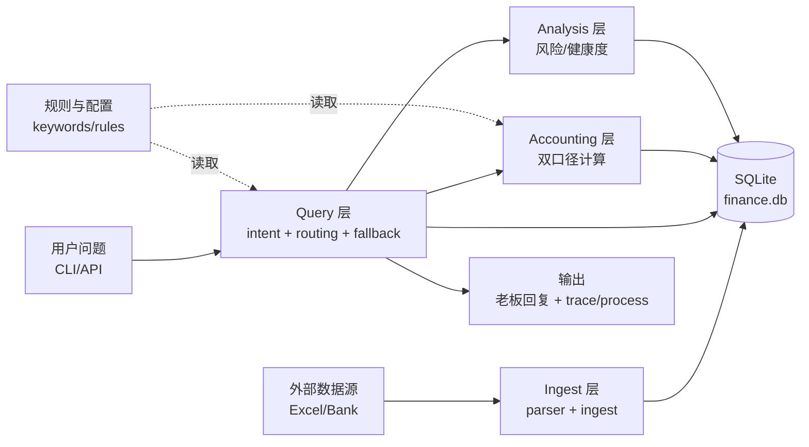

# 分层架构图（Layered Architecture）

```mermaid
flowchart LR
    A["外部数据源<br/>Excel/Bank"] --> B["Ingest 层<br/>parser + ingest"]
    B --> C[("SQLite<br/>finance.db")]

    U["用户问题<br/>CLI/API"] --> Q["Query 层<br/>intent + routing + fallback"]
    Q --> ACC["Accounting 层<br/>双口径计算"]
    Q --> ANA["Analysis 层<br/>风险/健康度"]
    Q --> C
    ACC --> C
    ANA --> C

    CFG["规则与配置<br/>keywords/rules"] -.读取.-> Q
    CFG -.读取.-> ACC

    Q --> O["输出<br/>老板回复 + trace/process"]
```

## 说明

1. `Query` 是业务入口，负责意图识别、实体识别、路由和兜底。
2. `Accounting` 负责“钱口径/账口径”计算与勾稽。
3. 所有结构化数据统一落在 `SQLite`，便于审计回溯。
