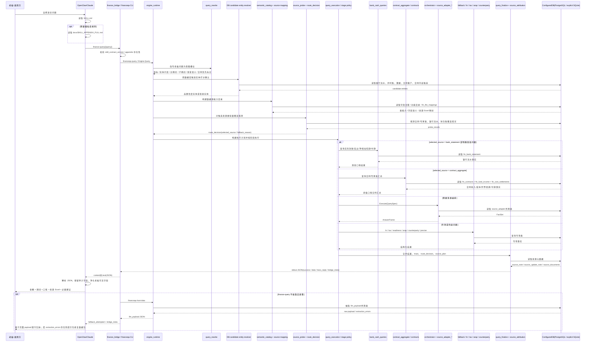

# 查询请求时序图（Query Sequence）

## 说明

1. OpenClaw 桥接返回的是 `content[0].text`，宿主必须先把 text 解析成 JSON，再生成自然语言回答。
2. 不能只看 CLI 退出码；业务失败时 `stdout` 仍可能包含结构化 JSON。
3. 老板核心指标先走合同/专家表候选，但必须经过轻量探测确认覆盖；不能因为识别到实体就绕开合同口径。
4. 明确现金问题不强行走合同汇总，直接优先银行流水。
5. `route_decision/probe_results` 是宿主和审计链路使用的口径解释字段，不能原样贴给老板。
6. `source_note` 是老板可见来源说明的主入口；`source_update_note` 是老板可见来源更新时间。宿主应优先直接引用，不要用 SQL、表名、字段名、表注释或历史记忆重拼来源。
7. 财务来源文件名和更新时间只从 `fin_file_mappings` 获取；没有映射就不展示该财务来源。合同和发票来源分别来自 `contract_main`、`contract_invoices`。
8. `source_cell_notes` 和 `remarks` 是宿主 LLM 可用的补充解释字段，用于备注、批注、谈判状态、异常说明和单元格依据；普通金额答案不默认展开，且不能替代 `source_note/source_update_note`。
9. 如果结果来自序时账经营口径，必须消费 `data.tax_inclusion/data.tax_inclusion_note`，说明默认未主动剔税。
10. 老板可见回复必须过滤数据库 id、合同 id、科目代码、SQL、trace、bridge_meta 等辅助字段。
