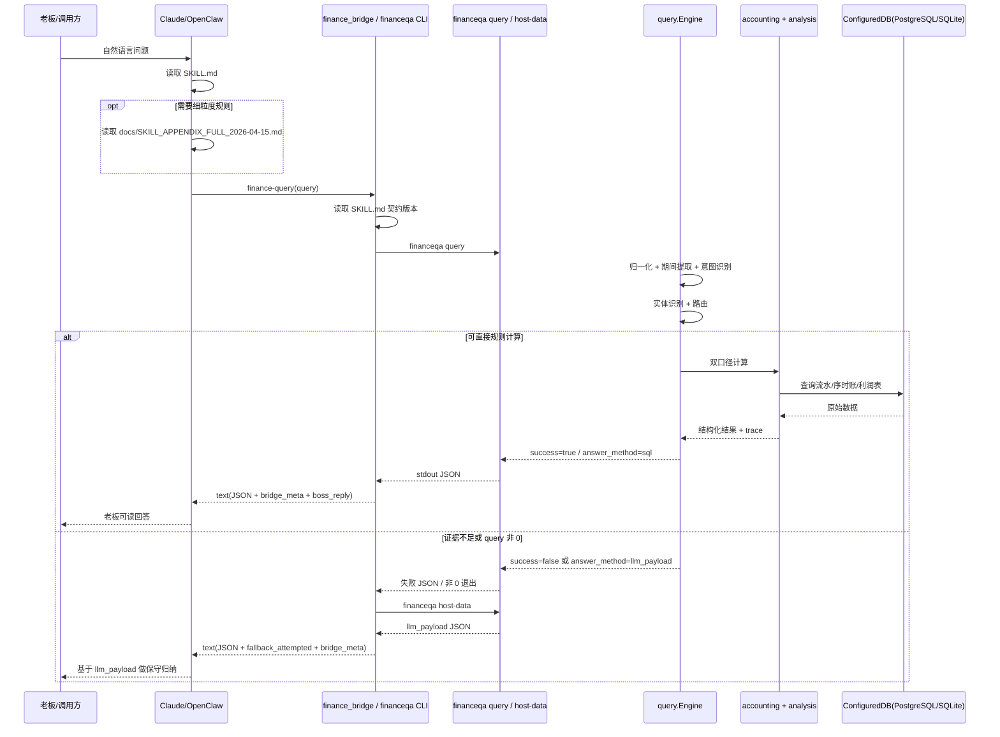

# 查询请求时序图（Query Sequence）

## 说明

1. OpenClaw 桥接返回的是 `text`，宿主需要把 `content[0].text` 再解析成 JSON。
2. 不能只看 CLI 退出码；即使 exit code 非 0，也要先解析 `stdout` 里的结构化 JSON。
3. 当 `finance-query` 不能稳定回答时，bridge 会自动补调 `host-data`，返回 `llm_payload` 给宿主继续归纳。
