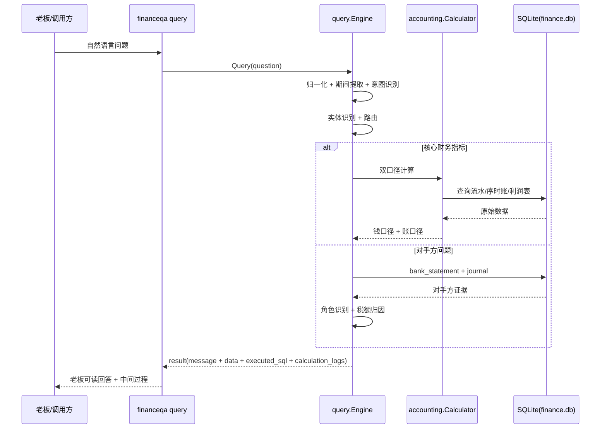

# 查询请求时序图（Query Sequence）

```mermaid
sequenceDiagram
    participant Boss as 老板/调用方
    participant CLI as financeqa query
    participant Eng as query.Engine
    participant Calc as accounting.Calculator
    participant DB as SQLite(finance.db)

    Boss->>CLI: 自然语言问题
    CLI->>Eng: Query(question)
    Eng->>Eng: 归一化 + 期间提取 + 意图识别
    Eng->>Eng: 实体识别 + 路由
    alt 核心财务指标
        Eng->>Calc: 双口径计算
        Calc->>DB: 查询流水/序时账/利润表
        DB-->>Calc: 原始数据
        Calc-->>Eng: 钱口径 + 账口径
    else 对手方问题
        Eng->>DB: bank_statement + journal
        DB-->>Eng: 对手方证据
        Eng->>Eng: 角色识别 + 税额归因
    end
    Eng-->>CLI: result(message + data + executed_sql + calculation_logs)
    CLI-->>Boss: 老板可读回答 + 中间过程
```

## 说明

1. 每次查询都应返回 `trace/process`，保证可解释。
2. 当证据不足时，回答必须保守，不做无依据结论。
