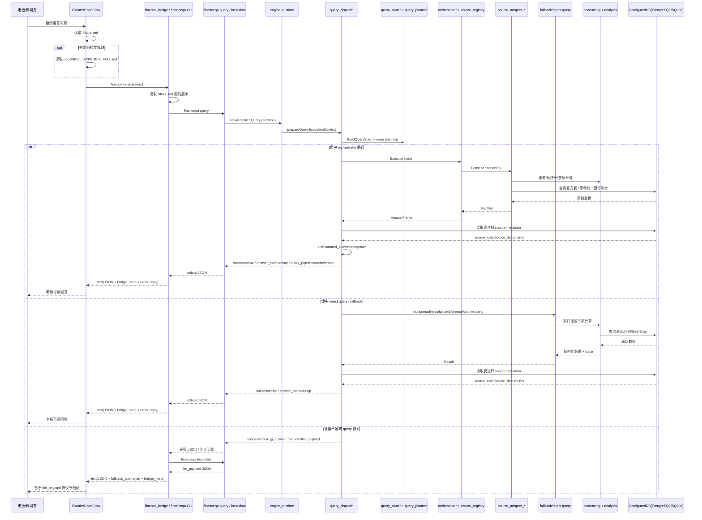

# 查询请求时序图（Query Sequence）

## 说明

1. OpenClaw 桥接返回的是 `text`，宿主需要把 `content[0].text` 再解析成 JSON。
2. 不能只看 CLI 退出码；即使 exit code 非 0，也要先解析 `stdout` 里的结构化 JSON。
3. 当前查询主链路已不是单个 `query.Engine` 大方法，而是 `engine_runtime -> query_dispatch -> router/planner -> orchestrator/direct query` 的分层执行。
4. 当响应里出现 `query_pipeline=orchestrator` 时，说明后端已经完成多源聚合与主口径选择，宿主不要再自行重排核心事实。
5. 当 `finance-query` 不能稳定回答时，bridge 会自动补调 `host-data`，返回 `llm_payload` 给宿主继续归纳。
6. 当响应里带有 `data.tax_inclusion` / `data.tax_inclusion_note` 时，宿主必须把这两项当成结构化口径约束消费，不要只从 `message` 文案里猜税口径。
7. 当 `bridge_meta.capabilities.tax_disclosure=true` 时，表示 bridge 已显式暴露税口径提示；宿主摘要时应优先引用结构化字段。
8. 当响应里带有 `data.source_note` 时，宿主应优先直接引用它；不要自己根据表名、SQL 或 `source_tables` 重新拼来源说明。
