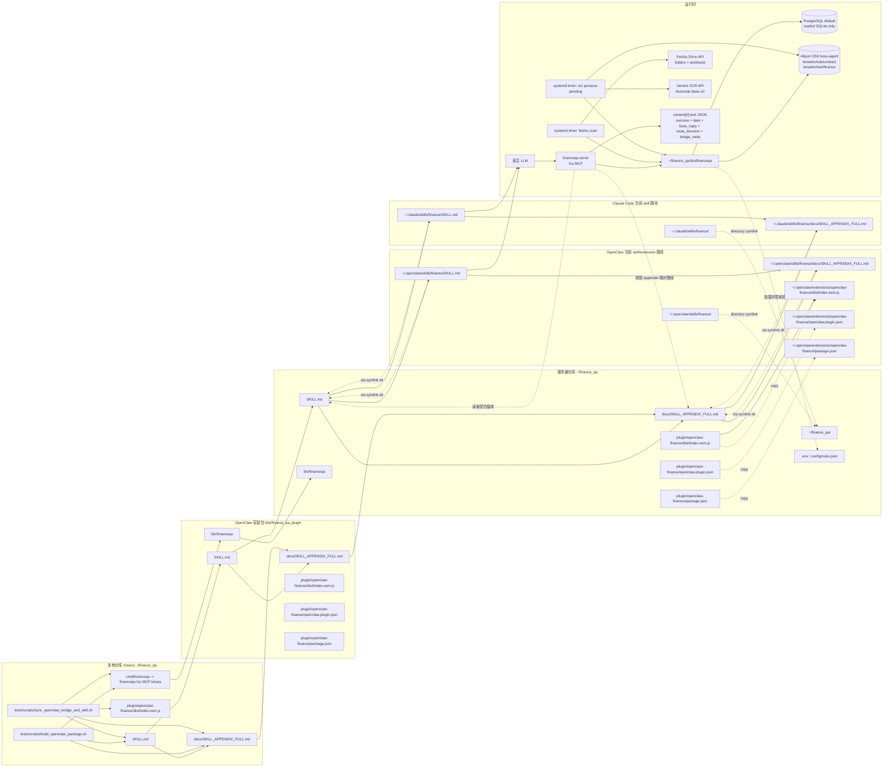

# 部署与运行图（Deployment & Runtime）



## 默认路径

1. 本地仓库根：`/Users/gaorongvc/work/other/finance_qa`
2. 服务器仓库根：`~/finance_qa`
3. OpenClaw 全局 skill 目录：`~/.openclaw/skills/finance`
4. OpenClaw extension runtime 目录：`~/.openclaw/extensions/openclaw-finance`
5. Claude Code skill 目录：`~/.claude/skills/finance`
6. 废弃路径：`~/.openclaw/extensions/openclaw-finance/skills/finance` 与 `~/.openclaw/workspace/skills/finance-orchestrator` 不再作为发布或验证目标。

## 发布约束

1. 发布到宿主时必须保留 `SKILL.md -> docs/SKILL_APPENDIX_FULL.md` 相对路径。
2. 线上 Go MCP 固定且唯一的二进制是 `~/finance_qa/bin/financeqa`，代码变更后需要重新编译该文件。
3. Go MCP 只读取 `SKILL.md` 契约版本和 appendix 是否存在，不把 appendix 正文注入响应；正文规则由 OpenClaw/Claude 的 skill 机制读取。
4. OpenClaw/Claude 当前可调用 Go MCP 工具有 5 个：`finance-query`、`finance-host-data`、`finance-upload`、`finance-sync`、`finance-dimensions`。
5. `finance-query` 推荐 MCP 调用格式：`{"jsonrpc":"2.0","id":2,"method":"tools/call","params":{"name":"finance-query","arguments":{"query":"..."}}}`。
6. `sync_openclaw_bridge_and_skill.sh` 负责同步 `SKILL.md`、appendix 和 OpenClaw 插件运行时到服务器仓库；脚本会先在本地交叉编译 Linux `financeqa`，再上传到 `~/finance_qa/bin/financeqa`。`SERVER` 默认使用本机 SSH config alias `lzh`，也可由调用方通过环境变量覆盖；`KEY_PATH` 仅在不走 SSH config 时可选传入。仓库中不保留生产 IP、端口或私钥路径。OpenClaw extension runtime 文件拷贝到 `~/.openclaw/extensions/openclaw-finance`，OpenClaw/Claude skill 目录整体软链接到 `~/finance_qa`。脚本只读校验 `openclaw.json` 中的 finance plugin/skill 运行配置，只更新 `plugins.installs.openclaw-finance.version/installedAt` 安装元数据，并默认重启 OpenClaw Gateway 让新的 extension runtime 生效。
7. OpenClaw extension 只保留 runtime 实文件；不要把 extension 目录、`dist/index.esm.js`、`openclaw.plugin.json` 或 `package.json` 挂成指向仓库的软链接。目录级 symlink 适用于 OpenClaw/Claude skill，因为文件级 symlink 会被 OpenClaw skill loader 判定为越过配置根目录并跳过。
8. `finance_qa`、Go MCP、OpenClaw plugin metadata 和 `openclaw.json` 中的 OpenClaw install metadata 当前版本均为 `2.0.12`；较大的运行时、部署或宿主接入变更必须提升 semver 版本，并保持这些版本同步。
9. OpenClaw 插件发现依赖 `plugin/openclaw-finance/package.json` 的 `openclaw.extensions`，当前必须包含 `./dist/index.esm.js`；`openclaw.json` 的 install version 只负责安装元数据同步，不负责发现插件。

## 运行时要点

1. OpenClaw / Claude 负责读取 skill 正文，并在需要时按相对路径读取 appendix。
2. `financeqa serve` 负责 MCP 工具注册、调用 Go 查询/导入/同步实现、补充 `bridge_meta.capabilities`，并在需要时返回可供宿主兜底的 `finance-host-data` payload。
3. `financeqa` 默认读取 PostgreSQL 配置；只有显式传入 SQLite 路径才使用本地兼容模式。
4. 查询结果 JSON 会保留 `route_decision/probe_results/trace/executed_sql` 等审计字段，但宿主给老板回复时必须净化成业务语言。
5. 如果 `finance-query` 无法稳定回答，Go MCP 会返回兜底结构；若 `extraction_errors` 存在，宿主不能把半截 payload 当完整事实回答。

## 飞书、OSS 与 OCR 部署

V1 使用主动扫描，不部署 webhook 服务。线上用 `systemd timer` 管理两个后台任务，不再使用 cron。原因是 `systemd` 能统一管理状态、日志、失败记录和下次触发时间；`oneshot` service 还可以避免同一个任务在上一次未结束时重叠启动。

```bash
sudo cp deploy/systemd/financeqa-feishu-scan.* /etc/systemd/system/
sudo cp deploy/systemd/financeqa-ocr-worker.* /etc/systemd/system/
sudo systemctl daemon-reload
sudo systemctl enable --now financeqa-feishu-scan.timer
sudo systemctl enable --now financeqa-ocr-worker.timer

systemctl list-timers 'financeqa-*'
systemctl status financeqa-feishu-scan.service
systemctl status financeqa-ocr-worker.service
journalctl -u financeqa-feishu-scan.service -n 100 --no-pager
journalctl -u financeqa-ocr-worker.service -n 100 --no-pager
```

当前 timer 策略：`financeqa-feishu-scan.timer` 在上一次扫描结束 10 分钟后再次触发；`financeqa-ocr-worker.timer` 在上一次 OCR worker 结束 5 分钟后再次触发。这样扫描或 OCR 偶尔变慢时不会并发叠加。

如果从 macOS 本机部署到 Linux 服务器，先交叉编译 Linux 二进制，避免把 macOS Mach-O 文件覆盖到服务器：

```bash
GOOS=linux GOARCH=amd64 go build -o bin/financeqa ./cmd/financeqa
```

运行链路：

1. `feishu scan` 主动调用飞书 API，扫描 `feishu_sync_sources` 中已配置的财务表格、财务表文件夹和 PDF 文件夹；来源由 `FEISHU_SYNC_SOURCES_FILE` 或 `FEISHU_SYNC_SOURCES_JSON` 通过 `feishu seed-sources` 写入，不在代码里固化租户 token。财务表推荐配置为 `finance_workbook_folder`：来源 token 是共享文件夹 token，扫描时在文件夹内选择最新修改的工作簿，避免旧工作簿删除重传后固定文件 token 失效。
2. PDF 下载到本地 snapshot 后计算 SHA256；hash 已存在时直接复用已有 `storage_key`，不重复上传。合同 PDF 写入 `contract_main`，发票 PDF 写入 `contract_invoices`，发票只按去掉 `发票/开票/invoice` 目录后的关系 key 关联到同目录合同，不按文件名猜测。hash 新增或同业务位置内容变化时，才上传到 `boss-agent` 的历史合同前缀，默认 `tenant/uhub/contract`，可用 `feishu_sync_sources.metadata_json.oss_prefix` 精确到 `tenant/uhub/contract/优集客户合同` 等子目录。
3. 财务表格下载或导出为 `.xlsx`，hash 未变则跳过上传和导入；hash 变化则先写入 `tenant/uhub/finance` 或显式配置的 `tenant/uhub/finance/2025`、`tenant/uhub/finance/2026` 历史前缀，再复用现有导入链路刷新 `fin_contracts`、`fin_fund_income`、`fin_cost_settlements` 及合并组表；导出文件中的 Excel 批注/单元格备注会按单元格坐标保存到各财务事实表的 `source_cell_notes`，收入明细可见“备注”列单独保存到收入表的 `remarks`；只有备注、没有金额的收入行会以当季末月 0 金额记录保留，不参与金额合计。`source_cell_notes` 和 `remarks` 主要供宿主 LLM 解释谈判状态、备注金额、异常说明和单元格依据，普通金额汇总不默认展开；OSS 快照 key、实际文件 token 和文件名写入 `feishu_sync_sources.metadata_json`。
   - 删除旧财务表并上传新表时，文件夹来源会选择新文件；OSS 按 SHA256 去重，同内容复用已有对象，不同内容写入新对象。若历史路径已有不同内容，使用 hash 后缀 key，避免覆盖旧快照。
4. `ocr process-pending` 消费 `contract_main.ocr_status='pending'` 和 `contract_invoices.ocr_status='pending'` 的 PDF；如果 `storage_key` 是 OSS object key 相对路径，例如 `tenant/uhub/contract/...pdf`，先从 `OSS_BUCKET` 下载临时文件，再调用 Gemini。旧的 `s3://bucket/...` 值仍兼容读取，但新写入统一保存相对路径。
5. OCR 结果写回对应表：合同写回 `contract_main` 并保存 `contract_pages` 全文；发票更新同一条 `contract_invoices`。未匹配到合同的发票不会落库，等待后续合同出现后再扫描。

历史数据迁移到相对 `storage_key`：

```bash
psql "$FINANCEQA_PG_DSN" -v ON_ERROR_STOP=1 -f db/migrations/20260505_relative_storage_keys.sql
```

飞书应用权限导入 JSON：

```json
{
  "scopes": {
    "tenant": [
      "drive:drive:readonly",
      "drive:drive.metadata:readonly",
      "drive:file:readonly",
      "drive:export:readonly",
      "sheets:spreadsheet:readonly"
    ],
    "user": []
  }
}
```

应用权限之外，还必须把应用授权到目标飞书文档：PDF 文件夹至少可阅读/可下载，财务表格至少可阅读/可导出。

## 线上环境变量

`.env` 放在 `~/finance_qa/.env` 或 `/etc/financeqa/financeqa.env`，并通过 `FINANCEQA_ENV_FILE` 指向它，权限建议为 `600`。必填项分组如下：

```env
# PostgreSQL
PGHOST=...
PGPORT=5432
PGUSER=...
PGPASSWORD=...
PGDATABASE=...
FINANCEQA_PG_SCHEMA=tenant_uhub

# Feishu active scan
FEISHU_APP_ID=cli_xxx
FEISHU_APP_SECRET=replace_with_secret
FEISHU_AUTH_MODE=tenant
# FEISHU_AUTH_MODE=user
# FEISHU_USER_TOKEN_FILE=~/finance_qa/secrets/feishu_user_token.json
# FEISHU_OAUTH_REDIRECT_URI=http://127.0.0.1:8787/feishu/oauth/callback
FINANCEQA_FEISHU_SNAPSHOT_DIR=tmp/feishu_snapshots

# Aliyun OSS ODS
OSS_ACCESS_KEY_ID=replace_with_access_key_id
OSS_ACCESS_KEY_SECRET=replace_with_access_key_secret
OSS_BUCKET=boss-agent
OSS_ENDPOINT=https://oss-cn-shenzhen.aliyuncs.com
OSS_CONTRACT_PREFIX=tenant/uhub/contract
OSS_FINANCE_PREFIX=tenant/uhub/finance
OSS_SMOKE_PREFIX=tmp/financeqa-smoke

# Gemini OCR
GEMINI_API_KEY=replace_with_key
GOOGLE_GEMINI_BASE_URL=https://api.ikuncode.cc
GEMINI_MODEL=gemini-3-flash-preview
GEMINI_PROXY=
GEMINI_OCR_TIMEOUT_SECONDS=240
GEMINI_OCR_MAX_FILE_MB=50
OCR_WORKER_LIMIT=10
OCR_WORKER_CONCURRENCY=2
```

## 部署验收

审核通过前可以先验证飞书下游链路：

```bash
go test ./... -count=1
go build -o bin/financeqa ./cmd/financeqa/...
RUN_LIVE_OSS_SMOKE=1 go test ./internal/storage -run TestLiveOSSUploadDownloadSmoke -count=1 -v
go test ./internal/feishusync -run 'TestPDFScanner|TestWorkbookScanner' -count=1
./bin/financeqa ocr process-file --file tmp/pdfs/gemini-smoke-contract.pdf
```

飞书应用审核通过且文档授权完成后，再跑真实闭环：

```bash
# 需先配置 FEISHU_SYNC_SOURCES_FILE=~/finance_qa/secrets/feishu_sources.json
# 或配置等价的 FEISHU_SYNC_SOURCES_JSON
./bin/financeqa feishu seed-sources
./bin/financeqa feishu scan --company "南京优集数据科技有限公司"
./bin/financeqa ocr process-pending --limit 10 --concurrency 2
```

常见边界：

1. 飞书返回 403：优先检查应用审核、scope 导入、文档协作者授权。
2. OSS 返回 403 且提示 second-level domain：必须使用 `https://oss-cn-shenzhen.aliyuncs.com`，代码会自动转为 bucket 三段域名访问。
3. OCR pending 未消费：检查 `GEMINI_API_KEY`、`GOOGLE_GEMINI_BASE_URL`、`contract_main.storage_key` 是否为空，以及 `sync_status` 是否为 `active`。
