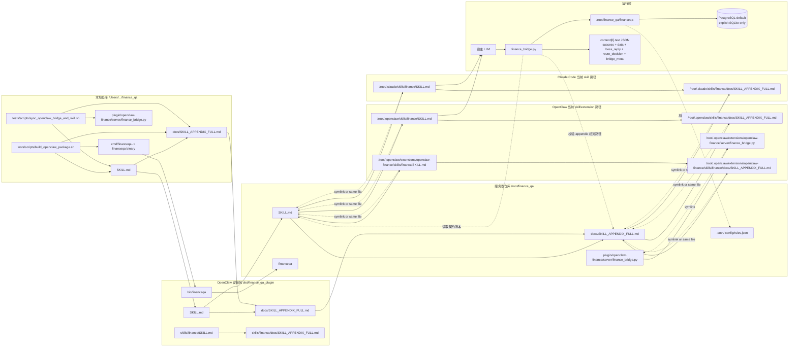

# 部署与运行图（Deployment & Runtime）

## 默认路径

1. 本地仓库根：`/Users/gaorongvc/work/other/finance_qa`
2. 服务器仓库根：`/root/finance_qa`
3. OpenClaw 全局 skill 兼容目录：`/root/.openclaw/skills/finance`
4. OpenClaw 扩展 skill 注册目录：`/root/.openclaw/extensions/openclaw-finance/skills/finance`
5. OpenClaw extension server 目录：`/root/.openclaw/extensions/openclaw-finance/server`
6. Claude Code skill 目录：`/root/.claude/skills/finance`
7. 废弃路径：`/root/.openclaw/workspace/skills/finance-orchestrator` 不再作为发布或验证目标。

## 发布约束

1. 发布到宿主时必须保留 `SKILL.md -> docs/SKILL_APPENDIX_FULL.md` 相对路径。
2. 线上 bridge 默认二进制是 `/root/finance_qa/financeqa`，代码变更后需要重新编译。
3. bridge 只读取 `SKILL.md` 契约版本和 appendix 是否存在，不把 appendix 正文注入响应；正文规则由 OpenClaw/Claude 的 skill 机制读取。
4. OpenClaw/Claude 当前可调用 bridge 工具有 5 个：`finance-query`、`finance-host-data`、`finance-upload`、`finance-sync`、`finance-dimensions`。
5. `finance-query` 推荐 MCP 调用格式：`{"action":"call","name":"finance-query","arguments":{"query":"..."}}`。
6. `sync_openclaw_bridge_and_skill.sh` 负责同步 `SKILL.md`、appendix 和 `finance_bridge.py`，并同时创建 OpenClaw 全局 skill 兼容路径与扩展 skill 注册路径 symlink。
7. Claude Code skill 路径也要同步或指向服务器仓库同一份 `SKILL.md` 与 appendix。

## 运行时要点

1. OpenClaw / Claude 负责读取 skill 正文，并在需要时按相对路径读取 appendix。
2. `finance_bridge.py` 负责工具注册、调用 `financeqa`、补充 `bridge_meta.capabilities`、失败时尝试 `host-data`。
3. `financeqa` 默认读取 PostgreSQL 配置；只有显式传入 SQLite 路径才使用本地兼容模式。
4. 查询结果 JSON 会保留 `route_decision/probe_results/trace/executed_sql` 等审计字段，但宿主给老板回复时必须净化成业务语言。
5. 如果 `finance-query` 无法稳定回答，bridge 会补调 `financeqa host-data`；若 `extraction_errors` 存在，宿主不能把半截 payload 当完整事实回答。
