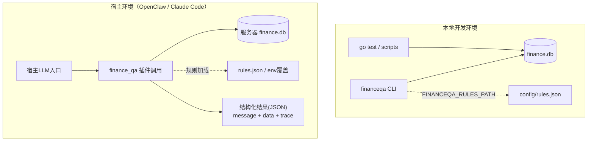

# 部署与运行图（Deployment & Runtime）

```mermaid
flowchart TB
    subgraph Local["本地开发环境"]
        C1["financeqa CLI"]
        C2["go test / scripts"]
        DB1[("finance.db")]
        R1["config/rules.json"]
        C1 --> DB1
        C2 --> DB1
        C1 -. FINANCEQA_RULES_PATH .-> R1
    end

    subgraph Host["宿主环境（OpenClaw / Claude Code）"]
        H1["宿主LLM入口"]
        H2["finance_qa 插件调用"]
        DB2[("服务器 finance.db")]
        R2["rules.json / env覆盖"]
        H1 --> H2
        H2 --> DB2
        H2 -. 规则加载 .-> R2
        H2 --> OUT["结构化结果(JSON)\nmessage + data + trace"]
    end
```

## 说明

1. 规则支持两种覆盖：`rules.json` 文件、环境变量。
2. 线上调用建议优先走结构化 JSON，宿主再做风格化表达。
